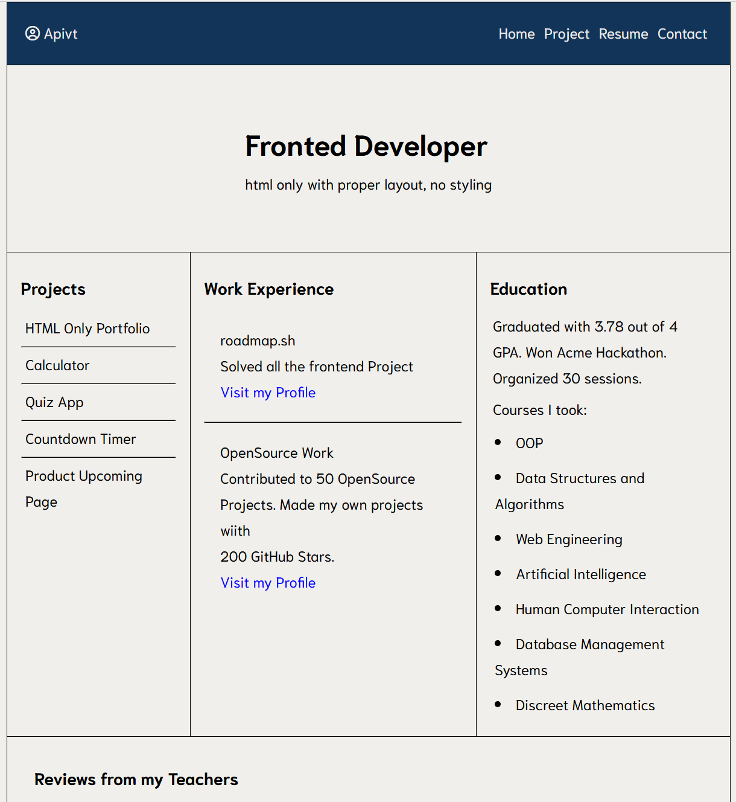
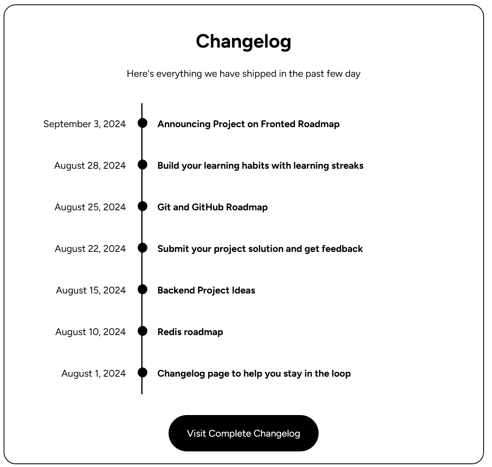
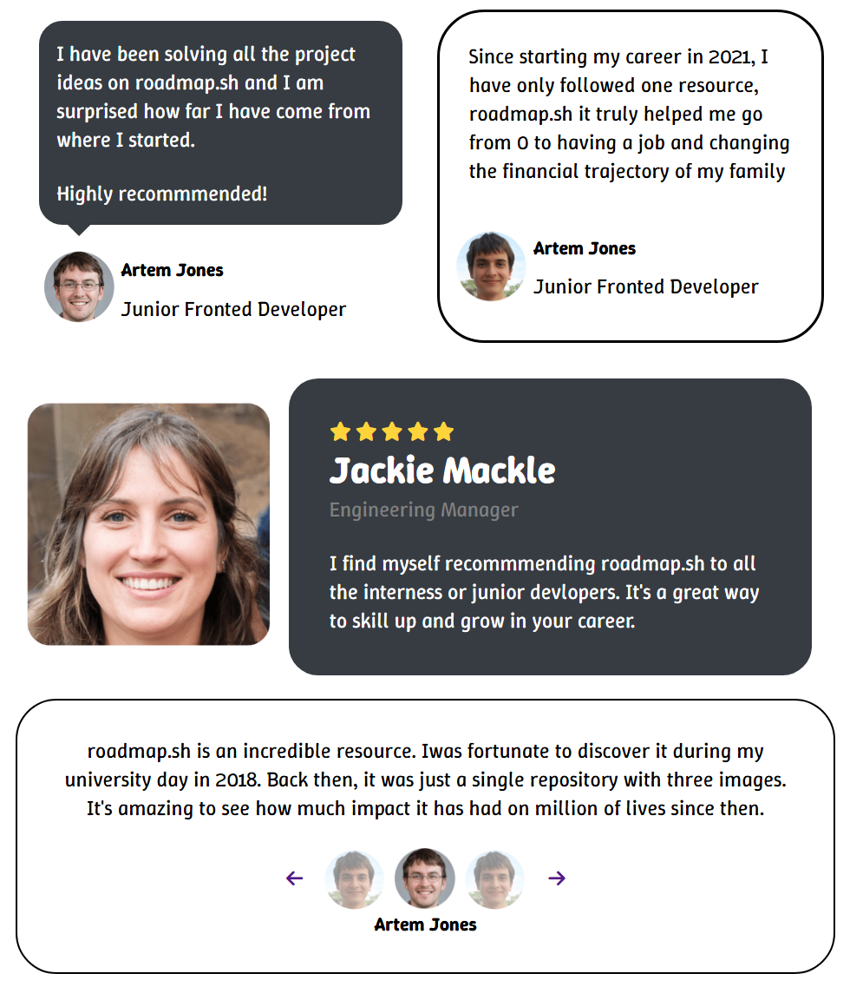

# 🚀 Frontend Roadmap.sh Projects

This repository showcases my journey in learning front-end development by completing hands-on projects from [Roadmap.sh](https://roadmap.sh/frontend).

> 📌 This repo is part of my practice and portfolio for real-world frontend experience — from basic HTML to more structured layouts.

---

## 📚  Example Projects 

| Project Name           | Description                                    | Preview                               | Demo |
|------------------------|------------------------------------------------|----------------------------------------|------|
| Single-Page CV         | A one-page HTML CV with structured layout      |  | [View Live](https://iceez555.github.io/IceEz555.githup.io/Frontend%20Projects/Single-Page%20CV/resume.html) |
| Basic HTML Website     | Static multi-page website with proper structure|      | [View Live](https://iceez555.github.io/IceEz555.githup.io/Frontend%20Projects/Basic%20HTML%20Website/home.html) |
| Changelog Component    | UI component for changelog display          |  | [View Live](https://iceez555.github.io/IceEz555.githup.io/Frontend%20Projects/Changelog%20Component/index.html) |
| Testimonial Cards      | A modern testimonial card layout            |  | [View Live](https://iceez555.github.io/IceEz555.githup.io/Frontend%20Projects/Testimonial%20Cards/Testimonial.html) |

---

## 🧠 Project Objectives

- ✅ Practice HTML5 Semantic Structure
- ✅ Practice CSS framework
- ✅ Understand project structure and asset management
- ✅ Organize information like resume, project list, and education

---

## 🛠 Tech Stack

- HTML5
- Semantic Tags
- Basic GitHub Pages for deployment
- CSS Frameworks 

---
## 📌 Upcoming Additions

- [ ] Add responsive styling (CSS only)
- [ ] Convert CV to fully styled version
- [ ] Add JavaScript-based projects
- [ ] Complete roadmap full section

---

## 🌐 Let's Connect

- GitHub: [IceEz555](https://github.com/IceEz555)
- Portfolio Website: _Coming soon_

---

> Inspired by [Roadmap.sh](https://roadmap.sh). Learning by doing is the best way to grow.
